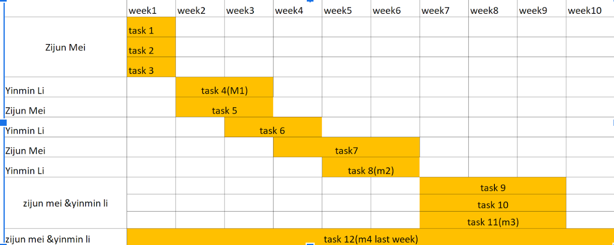
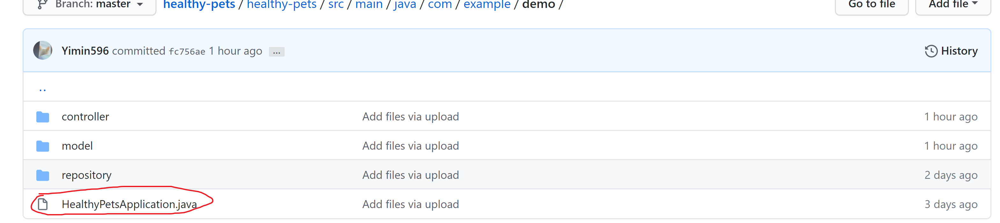

# Web Application of Healthy Pets
## Team member
"Zijun Mei" and "Yimin Li" 
## Abstract
The application our team would make is called healthy pets. The basic blocks of the application include input, search, output and FAQs page, which represent 4 functions of the application. For the input block, the user basically could type the pet information into the database for recording. The search block is made for users to get the information out of the database by type the keywords such as nickname, species, age. After user types in, the web server will respond and give an output page, which essentially shows the result of the searching or inputting. The FAQs page block is made for users to quickly get the direction to experience an application, and it will effectively improve the satisfaction of the user.
## Work breakdown structure (WBS) 
Task 1: Set up common repository 
Task 2: Set up environment 
Task 3: Realize the insert function of web app 
Task 4: Realize the search function of web app 
Task 5: Set up databases 
Task 6: Create the framework of output html page 
Task 7: Create image by using PS for the outlook of the pages. 
Task 8: Create FAQ pages 
Task 9: Create login page for the user 
Task 10: Connecting the Login page to the user database 
Task 11: Realize the function of the verification of users 
Task 12: Testing for the entire work 
## Schedule Table
 
## Milestone 1
 
## Release Notes
