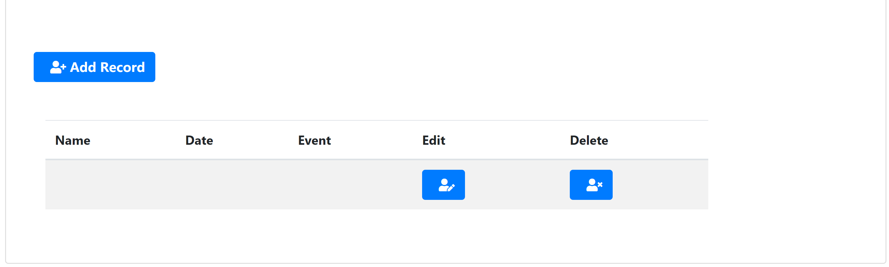

# Web Application of Healthy Pets
## Team member
"**Zijun Mei**" and "**Yimin Li**" 
## Abstract
The application our team would make is called healthy pets. The basic blocks of the application include input, search, output and FAQs page, which represent 4 functions of the application. For the input block, the user basically could type the pet information into the database for recording. The search block is made for users to get the information out of the database by type the keywords such as nickname, species, age. After user types in, the web server will respond and give an output page, which essentially shows the result of the searching or inputting. The FAQs page block is made for users to quickly get the direction to experience an application, and it will effectively improve the satisfaction of the user.
## Work breakdown structure (WBS) 
Task 1: Set up common repository 
Task 2: Set up environment 
Task 3: Realize the insert function of web app 
Task 4: Realize the search function of web app 
Task 5: Set up databases 
Task 6: Create the framework of output html page 
Task 7: Create image by using PS for the outlook of the pages. 
Task 8: Create FAQ pages 
Task 9: Create login page for the user 
Task 10: Connecting the Login page to the user database 
Task 11: Realize the function of the verification of users 
Task 12: Testing for the entire work 
## Schedule Table
 
## Milestone 1
As the schedual table shows, for malestone 1, we simply set up the common repository, set up the environment(srping boot, IDE, etc), and released some basic functions for the app.

 
As the picture showed above, run the java file which called **HealthPetsApplication.java**. After run the file successfully, open the browser and go to URL: http://localhost:8080/ to see the features of the applcation we made so far.

Here is the video of milestone 1. URL: https://use.vg/5Eu3i7.
## Release Notes

Since this is the first time we try to make a web application and there is only two members in our team, we barely have a direction to the target so that we have to keep in touch and working together all the time for making our work is on the right track. We edited the project plan which we create at the very first so that it can looks more reasonable(the original task 1 is to set up the cloud server, and now is to make the common repository). 
So far we create a some basic functions for reacording the information of the pets.

 
Based on the pictures showed above, we could see that the app are simply functionlized the creating, recording, editing and deleting.

